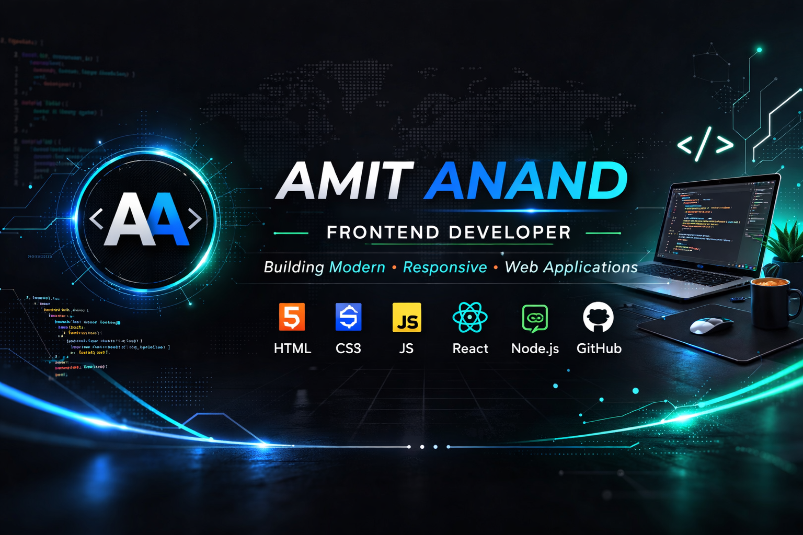

  

<h1 align="center">Hi 👋, I'm Amit Anand</h1>
<h3 align="center">Frontend Developer | Web Enthusiast | Problem Solver</h3>

  

---

### 👨‍💻 About Me
- 🌱 Currently learning **JavaScript, React JS & Backend Development**
- 💻 I enjoy building interactive and responsive websites
- 🧠 Interested in logic building and real-world projects
- ⚡ Fun fact: I fix bugs faster after tea ☕

---

### 📫 Contact Me
- Email: **amit.anand0526@gmail.com**

---

### 🌐 Connect With Me

&nbsp;&nbsp;

&nbsp;&nbsp;

---

### 🛠️ Tech Stack

#### 👨‍🎨 Frontend

#### ⚙️ Backend

#### 🗄️ Database

#### 🔧 Programming

---

### 📊 GitHub Activity

---

### 🔥 Current Focus
- Improving JavaScript & React skills
- Learning backend with Node.js & Express
- Working with MongoDB database
- Building real-world projects

---

### 🚀 Featured Projects

#### 🛒 Amazon Clone
A responsive e-commerce website inspired by Amazon.  
Features product listing UI, navigation bar, cart interface and responsive layout.
**Tech:** HTML, CSS, JavaScript

---

#### 👕 Myntra Clone
Frontend clone of Myntra shopping website with modern UI design and styling.
Includes homepage layout, banners, product cards and responsive design.
**Tech:** HTML, CSS, JavaScript

---

#### ☕ Coffee Shop Website
A stylish cafe website with landing page, menu section, and smooth UI layout.
Designed with focus on visuals and user experience.
**Tech:** HTML, CSS, JavaScript

---

#### 🧮 Calculator Web App
A functional calculator that evaluates mathematical expressions including brackets and percentage operations.
Handles expressions like `2(9+4)` and prevents invalid inputs.
**Tech:** HTML, CSS, JavaScript

---

#### 🌐 Personal Portfolio Website (Ongoing)
My personal developer portfolio where I showcase projects, skills and contact information.
Currently being improved with responsive design and better UI.
**Tech:** HTML, CSS, JavaScript (and upgrading to React)
- More Web Projects Coming Soon...

---
## 🚀 Live Projects

🛒 Amazon Clone  
https://amit0526.github.io/amazon-clone/

👕 Myntra Clone  
https://amit0526.github.io/myntra-clone/

🧮 Calculator  
https://amit0526.github.io/devcalc/

☕ Coffee Shop  
https://amit0526.github.io/coffee-shop/

---

