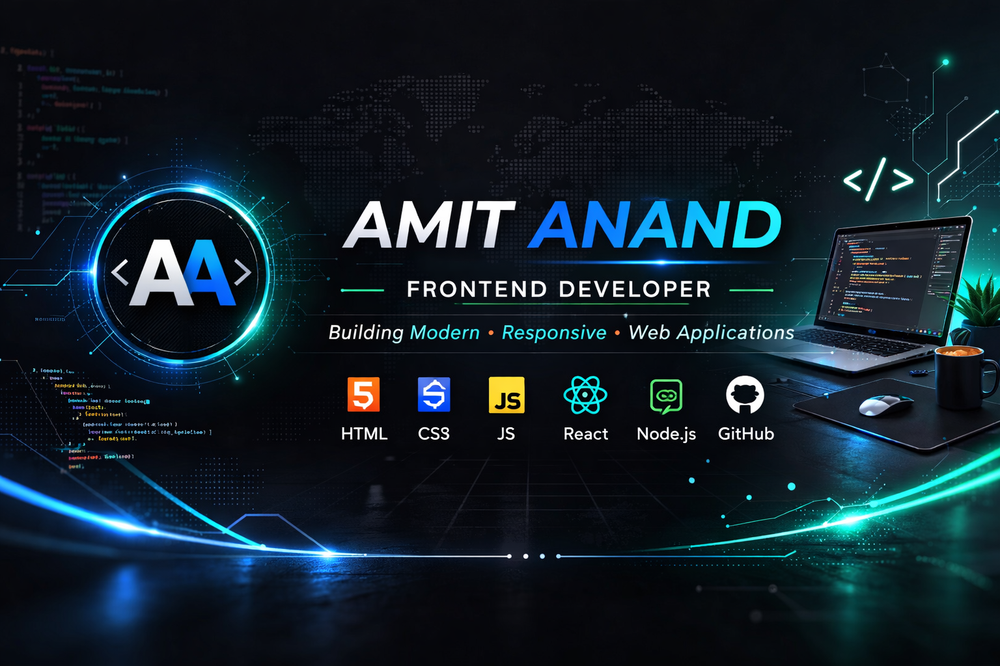

  

<h1 align="center">Hi 👋, I'm Amit Anand</h1>
<h3 align="center">Frontend Developer | Full-Stack Developer in Progress</h3>

  

---

## 👨‍💻 About Me

<table>
<tr>
<td width="50%">

- 🌱 Currently learning **JavaScript, React.js & Backend Development**
- ⚙️ Building backend applications with **Node.js & Express.js**
- 💻 I enjoy building interactive, responsive and user-friendly websites
- 🗄️ Learning and working with **MongoDB & SQL**
- 🚀 Interested in **Full-Stack Development** and real-world projects
- 🧠 Improving my problem-solving and logic-building skills
- ⚡ Fun fact: I fix bugs faster after tea ☕

</td>

<td width="50%">

</td>
</tr>
</table>

---

## 📫 Contact Me

- **Email:** amit.anand031020@gmail.com

---

## 🌐 Connect With Me

&nbsp;&nbsp;

&nbsp;&nbsp;

&nbsp;&nbsp;

---

## 🛠️ Tech Stack

### 🎨 Frontend

### ⚙️ Backend

### 🗄️ Database

### 🔧 Tools & Platforms

---

## 🚀 Current Focus

I'm currently working towards becoming a **Full-Stack Developer**.

- ⚡ Strengthening JavaScript fundamentals
- ⚛️ Improving React.js skills
- 🎨 Building modern UIs with Tailwind CSS
- 🧭 Working with React Router
- 🟢 Learning backend development with Node.js
- 🚂 Building APIs with Express.js
- 🍃 Working with MongoDB
- 🗄️ Learning SQL databases
- 🔗 Understanding frontend-backend communication
- 🛠️ Building real-world projects

---

## 📂 Featured Projects

### 🗂️ Project Showcase Website

A modern and interactive project showcase website built with **React.js**, designed to present projects in a clean, responsive and engaging interface.

**Features:**

- ⚛️ React-based component architecture
- 🧭 Client-side navigation with React Router
- 🎨 Responsive UI using Tailwind CSS
- 🎞️ Smooth animations and transitions with Framer Motion
- 🎯 Modern icons using React Icons
- ✨ Smooth scrolling experience
- 📱 Fully responsive design
- 🖱️ Interactive UI elements and animations

**Tech:** React.js, React Router, Tailwind CSS, Framer Motion, React Icons, React Smooth Scroll

🔗 **Live Demo:** https://project-showcase-gamma-woad.vercel.app/

---

### 💻 JavaScript Portfolio

A personal developer portfolio built with JavaScript to showcase my skills, projects and development journey.

**Features:**

- 👋 Personal introduction
- 🛠️ Skills and technologies
- 📂 Project showcase
- 📱 Responsive design
- 📫 Contact section
- ✨ Interactive UI

**Tech:** HTML, CSS, JavaScript

🔗 **Live Demo:** https://amit-anand-dev.vercel.app/

---

### 🧮 Calculator Web App

A functional calculator that evaluates mathematical expressions, including brackets and percentage operations.

**Features:**

- Mathematical expression evaluation
- Bracket support
- Percentage operations
- Input validation
- Expressions such as `2(9+4)`

**Tech:** HTML, CSS, JavaScript

🔗 **Live Demo:** https://neocalcapp.vercel.app/

---

### ☕ Coffee Shop Website

A stylish cafe website designed with a focus on visual presentation and user experience.

**Features:**

- Landing page
- Menu section
- Responsive layout
- Modern UI design

**Tech:** HTML, CSS, JavaScript

🔗 **Live Demo:** https://coffee-hub-psi.vercel.app/

---

### 🌐 Personal Portfolio Website

My personal developer portfolio where I showcase my projects, skills and development journey.

**Status:** 🚧 Ongoing

**Tech:** HTML, CSS, JavaScript → React.js

---

## 📊 GitHub Activity

---

## 🎯 Career Goal

I'm working towards becoming a **Full-Stack Developer** and looking for opportunities where I can:

- Build real-world applications
- Work with experienced developers
- Improve my frontend and backend skills
- Contribute to meaningful projects
- Continue learning modern web technologies

---

## 🚀 More Projects Coming Soon...

> **Learning → Building → Improving → Repeating.**
